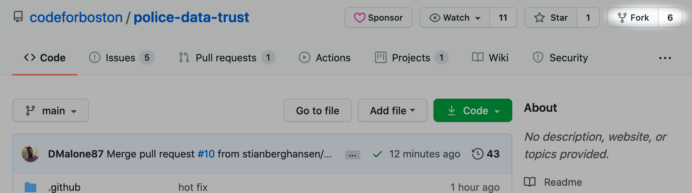

# Setup

This is a guide on how to do your first-time setup for running the website locally and getting ready to make changes to the code base.

If you are a developer, you should follow this guide before doing anything else!

This guide assumes you're a complete beginner at Python, Git, Postgres, etc. so don't be intimidated if you don't know what all of these things are. The main thing this guide assumes is that you know how to open up a terminal in your respective operating system (command prompt or "CMD" in Windows, and bash in OSX).

## Dependencies

Install all of the following programs onto your computer:

**Required:**

- [Python 3.8](https://www.python.org/downloads/)
- [Git](https://git-scm.com/book/en/v2/Getting-Started-Installing-Git) (first time setup guide [here](https://git-scm.com/book/en/v2/Getting-Started-First-Time-Git-Setup))
- [Postgres](https://www.postgresql.org/) _(see installation instructions below)_
- _(OSX only)_ [Homebrew](https://brew.sh/)

**Recommended:**

- A good text editor or IDE, such as [Atom.io](https://atom.io/) (which is lightweight and beginner friendly) or [PyCharm](https://www.jetbrains.com/pycharm/) (which is powerful but bulky and geared toward advanced users).
- [Heroku CLI](https://devcenter.heroku.com/articles/heroku-cli) _(required for remote deployment to Heroku.)_

???+ warning
    _(Windows users only)_ At least two Windows users have had problems getting Python working in Windows for the first time. Check out some people troubleshooting various Python installation related issues [on StackOverflow](https://stackoverflow.com/questions/13596505/python-not-working-in-command-prompt). Also note that the command to run Python in Windows may be `python`, `python3`, `py`, or `py3`. Figure out which one works for you.

You should also have a [GitHub account](https://github.com/). The GitHub account should have the same email as the one registered to your `git config --global user.email` that you set in the first time git setup.

### Postgres installation

=== "Windows (CMD)"
    1. Download [here](https://www.postgresql.org/download/windows/) and install via the executable.
    
    2. (If you had any terminals open, close out and reopen after Postgres installation.)
    
    3. Open command prompt and try the following (case-sensitive): `psql -V` If it returns the version number then you're set.
    
    4. If you get an error about the command not being recognized, then it might mean you need to manually add Postgres's bin to your PATH ([see here](https://stackoverflow.com/a/11567231)).

=== "OSX (Bash)"

    1. If you do not have Homebrew installed, install it from [here](https://brew.sh/).
    
    2. Via a bash terminal: `brew install postgres`
    
    3. Test that it works by running (case-sensitive): `psql -V`. If it returns the version number then you're set.

???+ tip
    Chances are you are not going to need Postgres to run in the background constantly, so you should learn how to turn it off and back on.
    
    === "Windows (CMD)"
        
        **Turn Postgres on/off:**
        
        1. Go to the Start menu and open up "Run..."
        
        2. `services.msc` -> ++enter++. This opens the Services panel.
        
        3. Look for the name _postgresql_ and start/stop Postgres.
        
        **Keep Postgres from running at startup:**
        
        (Via the Services panel) As long as the service is "manual" and not automatic, it will not load at startup.
        
    === "OSX (Bash)"
        
        **Turn Postgres on:**
        
        ```shell
        pg_ctl -D /usr/local/var/postgres start
        ```
        
        **Turn Postgres off:**
        
        ```shell
        pg_ctl -D /usr/local/var/postgres stop
        ```
        
        **Keep Postgres from running at startup:**
        
        Some solutions [here](https://superuser.com/questions/244589/prevent-postgresql-from-running-at-startup).

## Download and Setup the Code Base

The code base is open source. This section of the setup guide shows you the preferred way to install it and set up the code on a local computer.

1. Fork the [main GitHub repo](https://github.com/codeforboston/police-data-trust/) to your personal GitHub account. You can do that by going to the Code For Boston Police Data repo, and clicking on this button:



2. Point your terminal (Bash on OSX, command prompt on Windows) to the directory you want to put the `/police-data-trust` project folder inside of. E.g. if you want the project folder to be located at `<yourname>/Documents/police-data-trust`, then point your directory to `<yourname>/Documents`. You can change directories using the `cd` command: `cd "path/goes/here"`

3. Run the following to download your fork and setup the connection to the upstream remote. Replace `YOUR_USERNAME_HERE` (in the first line) with your actual GitHub username.

```shell
git clone https://github.com/YOUR_USERNAME_HERE/police-data-trust/
cd police-data-trust
git remote add upstream https://github.com/codeforboston/police-data-trust.git
git fetch upstream
```

4. In your newly created `police-data-trust` folder, run the following to create a "dot-env" file.

```shell
echo "FLASK_ENV=development" >>.env
```

???+ danger
    If you do any commits to the repo, _please make sure `.env` is properly gitignored!_ (`.flaskenv` does not need to be gitignored, only `.env`.) `.env` may sometimes contain sensitive information.

## Run the API Locally

After you get everything set up, you should run the website at least once. The process of running the website installs the remaining dependencies, and sets up a virtual environment to work in.

1. Run the following:

=== "Windows (CMD)"
    ```shell
    run_windows_dev
    ```

=== "OSX (Bash)"
    ```shell
    sh run_unix_dev.sh
    ```

???+ note
    The script being run is doing the following, in order:
    
    1. Set up a "virtual environment" (basically an isolated folder inside your project directory that we install the Python packages into),
    2. install the packages inside of `requirements/dev.txt`; this can take a while during your first time.
    3. Set up some environment variables that Flask needs.
    5. Set up the Postgres database and update it with data.
    6. Run the actual website.

???+ tip
    If you are receiving any errors related to the Postgres database and you are certain that Postgres is running on your computer, you can modify the `POSTGRES_USER` and `POSTGRES_PASSWORD` environment variables to connect to your local Postgres instance properly.
    
    You can also save these Postgres environment variables inside of your `.env` file, but **do not** save your system password (the password you use to login to your computer) in a plain text file. If you need to save a `POSTGRES_PASSWORD` in `.env`, make sure it's a unique password, e.g. an admin user `POSTGRES_USER=pdt` and a password you randomly generated for that user `POSTGRES_PASSWORD=my_random_password_here`.

2. Now just wait for the database to start filling in and for the website to eventually run.

???+ success
    You should be good if you eventually see something like the following in your terminal:
    
    ```
     * Serving Flask app "backend:create_app" (lazy loading)
     * Environment: development
     * Debug mode: on
     * Running on http://127.0.0.1:5000/ (Press CTRL+C to quit)
     * Restarting with stat
    ```

3. Point your browser of choice to the URL shown in the terminal output. If everything worked out, the website should be running on your local computer!
